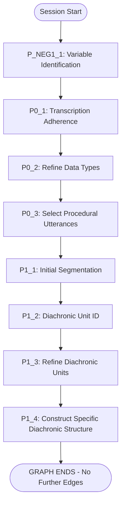

# µ-PATH LangGraph Pipeline Architecture

## Overview

The µ-PATH LangGraph backend implements a directed acyclic graph (DAG) for processing interview transcripts through a series of analytical steps. The current implementation provides a foundation for complex analysis but is **partially complete** with only the initial pipeline segments connected.

## Current Implementation Status

### Connected Pipeline (Implemented and Working)



### Implemented but Unconnected Nodes

The following nodes exist in the codebase but are not connected in the graph:

- **P2S Series**: P2S_1 (Group Utterances), P2S_2 (Identify SSU), P2S_3 (Define SSS)
- **P3 Series**: P3_1 (Align Structures), P3_2 (Identify GDUs), P3_3 (Define GDS)
- **P4S Series**: P4S_1_A (Identify SSS Nodes), P4S_1_B (Define GSS)
- **P5 Series**: P5_1 (Comparative Analysis), P5_2 (Holistic Refinement)
- **P7 Series**: P7_1 through P7_5 (Formalization and Hypothesis Generation)
- **P9_1**: Semantic GDU Mapping
- **COMPLETE**: Terminal node

## Graph State Structure

```typescript
interface GraphState {
  // Session Management
  sessionId: string;
  status: 'idle' | 'running' | 'completed' | 'failed' | 'paused';
  
  // Execution Tracking
  currentStep: string;
  lastCompletedStep?: string;
  progress: number; // 0-100
  
  // Input Data
  transcripts: Array<{
    id: string;
    filename?: string;
    content: string;
  }>;
  
  // User Configuration
  userDvFocus?: {
    dv_focus: string[];
  };
  
  // Step Results
  stepOutputs: Record<string, any>;
  errors: Record<string, StepError>;
  
  // Metadata
  metadata: {
    createdAt: number;
    updatedAt: number;
    pipelineVersion: string;
    settings: {
      model?: string;
      temperature?: number;
      seed?: number;
      useGrounding?: boolean;
    };
    currentPhaseName?: string;
    collectedNarrativeElements?: Array<any>;
    collectedProceduralUtterances?: Array<any>;
    collectedInitialSegments?: Array<any>;
    globalDvFocus?: string[];
  };
  
  // Special Inputs
  irr_inputs?: any; // For P9_1 node
}
```

## Node Implementation Pattern

All nodes extend `BaseNode` and follow this pattern:

```typescript
class ExampleNode extends BaseNode {
  id = StepId.EXAMPLE_NODE;
  name = 'Example Node';
  
  async execute(state: GraphState, context: ExecutionContext): Promise<Partial<GraphState>> {
    // 1. Validate inputs
    this.validateInputs(state);
    
    // 2. Process with LLM
    const result = await this.processWithLLM(state, context);
    
    // 3. Return state updates
    return {
      currentStep: this.id,
      lastCompletedStep: this.id,
      stepOutputs: {
        ...state.stepOutputs,
        [this.id]: result
      }
    };
  }
}
```

## Execution Flow

1. **Session Creation**
   - Create session with transcripts and settings
   - Initialize state with entry point: `P_NEG1_1_VARIABLE_IDENTIFICATION`

2. **Step Execution**
   - GraphExecutor retrieves current node
   - Node executes with retry logic (3 attempts, exponential backoff)
   - State is updated with results
   - Next step determined from edges

3. **Progress Tracking**
   - Based on topological sort of graph
   - Each step contributes to overall progress
   - COMPLETE step = 100%, others capped at 95%

4. **Session Persistence**
   - Configurable via `SESSION_STORE` environment variable
   - `memory`: InMemorySessionStore
   - `redis`: RedisSessionStore (default)

## Current Limitations

1. **Incomplete Graph**: Only 8 of 28 nodes are connected
2. **No Loops**: Despite the µ-PATH design requiring:
   - Per-transcript processing loops
   - Per-GDU analysis loops
   - Phase-based iterations
3. **No Conditional Routing**: Infrastructure exists but unused
4. **Missing Final Steps**: No report generation or completion handling
5. **Linear Only**: Current implementation is strictly sequential

## API Endpoints

```typescript
// Create new session
POST /api/graph/session
Body: {
  transcripts: Array<Transcript>
  settings?: {
    model?: string
    temperature?: number
    seed?: number
  }
  userDvFocus?: { dv_focus: string[] }
}
Response: { sessionId: string }

// Execute next step
POST /api/graph/execute
Body: {
  sessionId: string
  model?: string
  temperature?: number
  useGrounding?: boolean
  seed?: number
}
Response: {
  success: boolean
  completedStep?: string
  nextStep?: string
  hasMore: boolean
  error?: { message: string, stepId?: string }
}

// Get session state
GET /api/graph/session/:sessionId
Response: Session

// Delete session
DELETE /api/graph/session/:sessionId
Response: 204 No Content
```

## Error Handling

- **Retry Logic**: 3 attempts with exponential backoff
- **Error Classification**: Recoverable vs non-recoverable
- **Error Storage**: Errors tracked per step in state
- **Logging**: Comprehensive logging via ExecutionContext

## Future Implementation Needs

To complete the pipeline, the following needs implementation:

1. **Connect Remaining Nodes**: Add edges from P1_4 onwards
2. **Implement Loops**:
   - Transcript processing loop (P0-P2S per transcript)
   - GDU analysis loop (P4S nodes per GDU)
3. **Add Conditional Logic**:
   - Branch based on number of transcripts
   - Skip steps based on settings
4. **Implement P6_1**: Report generation node
5. **Complete Graph**: Connect all nodes to COMPLETE


# This is what the old frontend pipeline looked like before we switched to langgraph:

The pipeline is designed to:
- Process multiple transcripts.
- Systematically consider user-defined Dependent Variable (DV) focuses and Independent Variables (IVs) associated with transcripts.
- Perform Specific Diachronic and Synchronic analyses per transcript.
- Synthesize findings into Generic Diachronic and Synchronic structures.
- Incorporate Causal Structure Elicitation (Part VII).
- Conclude with a holistic refinement and a comprehensive Markdown report (Part VI).

A key feature is the generation of visualizations using Mermaid.js for diachronic (Gantt charts), synchronic (flowcharts/graphs), and causal (DAG) structures, which are embedded in the final report and HTML appendix. The system also includes a JSON self-correction mechanism for API responses to enhance robustness.

This document details each part of the pipeline, the prompts used, and the iterative nature of the process.

## 2. Overall Iteration Logic

The pipeline processes transcripts and analysis stages with specific iteration patterns:

1.  **Part -1: Variable Identification:**
    *   Step `P_NEG1_1_VARIABLE_IDENTIFICATION` is executed for Transcript 1, then Transcript 2, ..., up to Transcript N.
    *   Once all transcripts have completed Part -1, the pipeline proceeds to Part 0.

2.  **Part 0: Data Preparation:**
    *   Steps `P0_1_TRANSCRIPTION_ADHERENCE`, `P0_2_REFINE_DATA_TYPES`, `P0_3_SELECT_PROCEDURAL_UTTERANCES` are executed sequentially for Transcript 1.
    *   Then, this sequence is repeated for Transcript 2, ..., up to Transcript N.
    *   Once all transcripts have completed Part 0, the pipeline proceeds to Part I.

3.  **Part I (Specific Diachronic Analysis) & Part II_S (Specific Synchronic Analysis):**
    *   For Transcript 1:
        *   Steps `P1_1_INITIAL_SEGMENTATION`, `P1_2_DIACHRONIC_UNIT_ID`, `P1_3_REFINE_DIACHRONIC_UNITS`, `P1_4_CONSTRUCT_SPECIFIC_DIACHRONIC_STRUCTURE` (Part I) are executed sequentially.
        *   The output of `P1_4` (Specific Diachronic Structure) defines a set of diachronic phases.
        *   **Part II_S Iteration (for Transcript 1):** For each diachronic phase identified in P1.4:
            *   Steps `P2S_1_GROUP_UTTERANCES_BY_TOPIC`, `P2S_2_IDENTIFY_SPECIFIC_SYNCHRONIC_UNITS`, `P2S_3_DEFINE_SPECIFIC_SYNCHRONIC_STRUCTURE` are executed sequentially for that phase.
    *   This entire sequence (Part I followed by iterative Part II_S for all its phases) is then repeated for Transcript 2, ..., up to Transcript N.
    *   Once all transcripts have completed Parts I and II_S (for all their respective phases), the pipeline proceeds to Part III.

4.  **Part III (Generic Diachronic Analysis):**
    *   These are global steps, executed once after all transcripts have completed Parts I and II_S.
    *   Steps `P3_1_ALIGN_STRUCTURES`, `P3_2_IDENTIFY_GDUS`, `P3_3_DEFINE_GENERIC_DIACHRONIC_STRUCTURE` are executed sequentially.
    *   The output of `P3_3` (Generic Diachronic Structure) identifies core Generic Diachronic Units (GDUs).

5.  **Part IV_S (Generic Synchronic Analysis):**
    *   This part is triggered after `P3_3` completes.
    *   **Part IV_S Iteration:** For each core GDU identified in P3.3:
        *   Step `P4S_1_A_IDENTIFY_AND_GROUP_SSS_NODES` is executed.
        *   Step `P4S_1_B_DEFINE_GSS_FROM_GROUPS` is then executed for the same GDU.
    *   This A -> B sequence repeats for all core GDUs. Once complete, the pipeline proceeds to Part V.

6.  **Part V (Refinement):**
    *   This is a global step, executed once after Part IV_S is complete (all core GDUs processed).
    *   `P5_1_HOLISTIC_REVIEW_REFINEMENT` runs.

7.  **Part VII (Causal Structure Elicitation):**
    *   These are global steps, executed sequentially once after Part V (Refinement) is complete.
    *   Steps `P7_1_CANDIDATE_VARIABLE_FORMALIZATION`, `P7_2_PROPOSE_PAIRWISE_CAUSAL_LINKS`, `P7_3_ASSEMBLE_DAG_AND_IDENTIFY_PATTERNS`, `P7_3B_VALIDATE_AND_CLEAN_DAG`, `P7_4_ANALYZE_PATHS_AND_BIASES`, `P7_5_GENERATE_FORMAL_HYPOTHESES` are executed sequentially.

8.  **Part VI (Report Generation):**
    *   This is a global step, executed once after Part VII (Causal Structure Elicitation) is complete.
    *   `P6_1_GENERATE_MARKDOWN_REPORT` runs. If successful, the pipeline state becomes `COMPLETE`.


