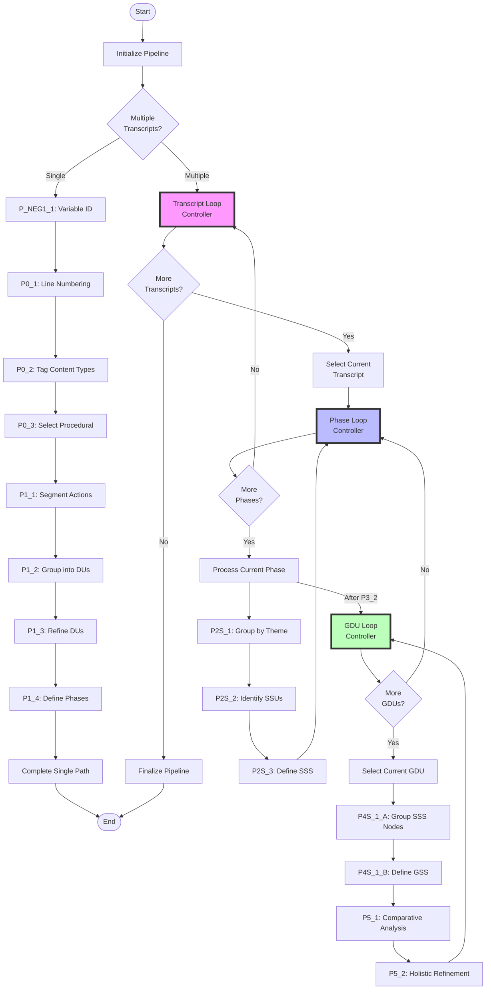
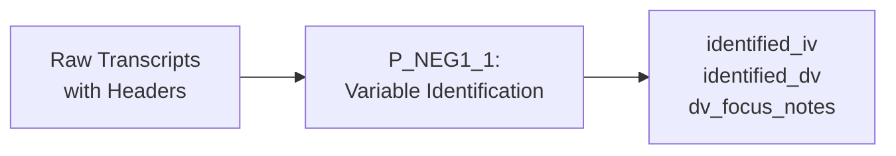
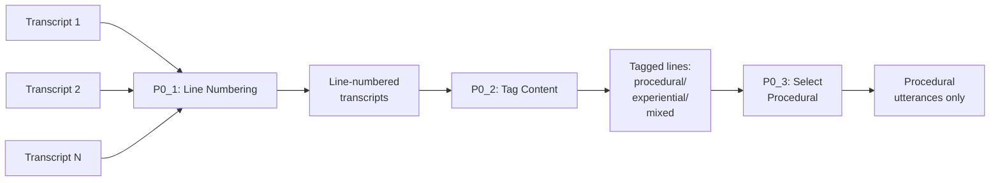
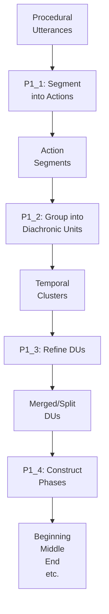
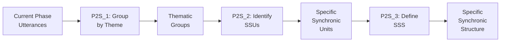
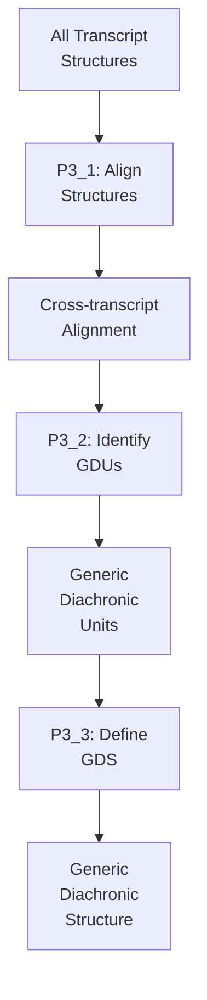
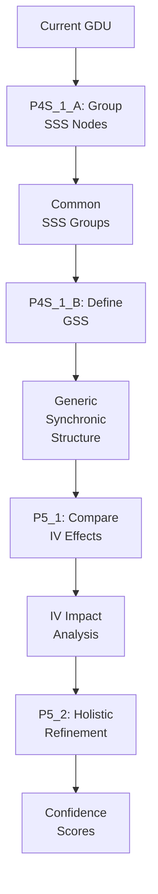
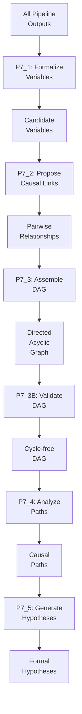

# µ-PATH LangGraph Pipeline - Product Requirements Document

## Overview

The µ-PATH (micro-Procedural Alignment Through Horizontalization) pipeline is a stateful workflow implemented using LangGraph.js that processes interview transcripts through systematic phenomenological analysis to generate formal causal hypotheses.

## Pipeline Architecture: Three Nested Loops



## Data Flow Through Pipeline Nodes

### Phase -1: Variable Identification



**P_NEG1_1 Purpose**: Extracts independent variables (IV) and dependent variables (DV) from transcript headers to set analysis focus.

### Phase 0: Data Preparation (All Transcripts)



### Phase 1: Specific Diachronic Analysis (Per Transcript)



### Phase 2S: Specific Synchronic Analysis (Per Phase)



### Phase 3: Generic Diachronic Analysis



### Phase 4S & 5: Generic Synchronic Analysis (Per GDU)



### Phase 7: Causal Modeling



## Loop Logic Details

### 1. Transcript Loop (Outer)
- **Controller**: `transcriptLoopController`
- **Counter**: `currentTranscriptIndex`
- **Logic**: Increments index, resets phase and GDU indices
- **Termination**: When `currentTranscriptIndex >= transcripts.length`

### 2. Phase Loop (Middle)
- **Controller**: `phaseLoopController`
- **Counter**: `currentPhaseIndex`
- **Sequence**: [P2S_1, P2S_2, P2S_3, P3_1, P3_2, P3_3, gdu_loop, P7_1, ...]
- **Logic**: Processes phases identified by P1_4 for current transcript
- **Termination**: When all phases processed

### 3. GDU Loop (Inner)
- **Controller**: `gduLoopController`
- **Counter**: `currentGDUIndex`
- **Logic**: Processes each GDU identified by P3_2
- **Nodes**: P4S_1_A → P4S_1_B → P5_1 → P5_2
- **Termination**: When `currentGDUIndex >= gdus.length`

## State Management

```typescript
interface UPathMVPState {
  // Pipeline control
  pipelineId: string;
  status: 'pending' | 'running' | 'completed' | 'failed';
  progress: number;
  
  // Data
  transcripts: RawTranscript[];
  stepOutputs: Record<string, any>;
  gdus: GDU[];
  
  // Loop indices
  currentTranscriptIndex: number;
  currentPhaseIndex: number;
  currentGDUIndex: number;
  
  // Configuration
  settings: {
    model: string;      // Default: gemini-2.5-flash
    temperature: number;
    seed: number;
    useGrounding: boolean;
  };
  
  // Control flags
  isMultiTranscript: boolean;
  currentPhase: string;
  
  // Error tracking
  errors: ErrorInfo[];
}
```

## Key Technical Decisions

1. **Persistence**: SqliteSaver for state persistence across server restarts
2. **Streaming**: Server-Sent Events (SSE) for real-time progress updates
3. **Configuration**: Dynamic model selection from environment/request
4. **Error Handling**: GraphInterrupt for graceful failure recovery
5. **Conditional Routing**: Graph edges determine single vs multi-transcript paths

## API Endpoints

### POST /api/langgraph/stream
Starts pipeline execution with streaming updates.

**Request:**
```json
{
  "transcripts": [
    {
      "id": "t1",
      "content": "Interview transcript text...",
      "metadata": {
        "iv": "experience_level",
        "dv": "task_completion_time"
      }
    }
  ],
  "settings": {
    "model": "gemini-2.5-flash",
    "temperature": 0.7
  }
}
```

**Response:** Server-Sent Events stream with progress updates

## Implementation Status

✅ **Completed:**
- All 28 pipeline nodes implemented
- Three nested loops (transcript, phase, GDU)
- Single vs multi-transcript routing
- SqliteSaver persistence
- Dynamic configuration
- Streaming endpoint

⏳ **Pending:**
- Error handling with GraphInterrupt
- Comprehensive testing
- Frontend integration
- Performance optimization

## Performance Considerations

1. **Memory**: Large transcripts may require chunking
2. **Processing Time**: ~2-5 minutes per transcript depending on length
3. **Persistence**: SQLite database grows with checkpoint history
4. **Concurrency**: Currently single-threaded, consider worker pools

## Future Enhancements

1. **Parallel Processing**: Process independent phases concurrently
2. **Caching**: Cache intermediate results for faster re-runs
3. **Visualization**: Real-time graph visualization of pipeline state
4. **Metrics**: Detailed timing and resource usage tracking
5. **Resume Capability**: Resume failed pipelines from last checkpoint