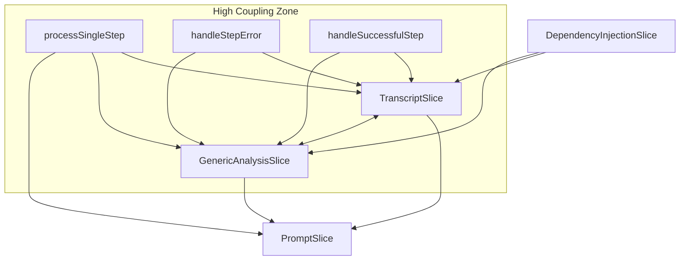

# Phase 1: Frontend State Refactoring - Dependency Mapping

## Overview
This document provides a comprehensive analysis of the monolithic `pipelineStore.ts` structure and dependencies to guide the Phase 1 refactoring process.

## Current Store Structure (30,927 tokens)

### Store Slices Analysis

#### 1. TranscriptSlice
- **Size**: ~8,000 tokens
- **State Properties**: 
  - `rawTranscripts: RawTranscript[]`
  - `processedData: Map<string, TranscriptProcessedData>`
- **Actions**:
  - `addTranscripts(files: File[])` - Adds new transcript files
  - `updateProcessedData(id: string, data: Partial<TranscriptProcessedData>)` - Updates transcript processing results
  - `removeTranscript(id: string)` - Removes transcript and its processed data
- **Dependencies**: Low coupling, mainly self-contained
- **Persistence**: Fully persisted

#### 2. GenericAnalysisSlice
- **Size**: ~15,000 tokens  
- **State Properties**:
  - `genericAnalysisState: GenericAnalysisState` (40+ properties for P3-P7 steps)
  - `lastStepInfo?: CurrentStepInfo` (UI sync)
  - `lastError?: string` (UI sync)
  - `lastHilContext?: HilContext` (UI sync)
  - `shouldStopAutorun?: boolean` (UI sync)
- **Actions**:
  - `updateGenericState(updates: Partial<GenericAnalysisState>)` - Updates analysis state
- **Dependencies**: High coupling with TranscriptSlice
- **Persistence**: Business logic persisted, UI state excluded

#### 3. PromptSlice
- **Size**: ~2,000 tokens
- **State Properties**:
  - `promptHistory: PromptHistoryEntry[]`
  - `totalInputTokens: number`
  - `totalOutputTokens: number`
- **Actions**:
  - `addPromptEntry(entry: PromptHistoryEntry)` - Adds API call to history
- **Dependencies**: None (write-only from other slices)
- **Persistence**: Fully persisted

#### 4. DependencyInjectionSlice
- **Size**: ~1,000 tokens
- **State Properties**:
  - `uiCallbacks?: UICallbacks`
- **Actions**:
  - `setUICallbacks(callbacks: UICallbacks)` - Sets UI update callbacks
- **Dependencies**: None
- **Persistence**: Not persisted (transient)

## Dependency Graph



## Cross-Slice Dependencies

### Critical Multi-Slice Actions

#### 1. `processSingleStep` (Main Orchestrator)
- **Reads from**: All slices
- **Writes to**: GenericAnalysisSlice UI state, PromptSlice
- **Complexity**: 500+ lines, touches all state
- **Risk**: High - Core business logic

#### 2. `handleStepError` 
- **Writes to**: TranscriptSlice + GenericAnalysisSlice error states
- **Pattern**: Duplicated error handling across slices
- **Risk**: Medium - Error state synchronization

#### 3. `handleSuccessfulStep`
- **Writes to**: TranscriptSlice + GenericAnalysisSlice output data
- **Special Case**: P1.4 updates multiple TranscriptSlice properties
- **Risk**: Medium - Data synchronization

#### 4. State Management Actions
- `resetPipeline`: Resets all slices
- `loadState`: Loads into 3 slices
- `getSaveState`: Reads from 3 slices
- `invalidateStateFromStep`: Complex cross-slice invalidation

## Consumer File Analysis

### Files Using pipelineStore (8 total)

1. **`/src/components/SessionRestoreNotification.tsx`** - Uses loadState action
2. **`/src/stores/pipelineStore.ts`** - Self-reference
3. **`/src/__tests__/autosave.integration.test.ts`** - Tests persistence
4. **`/src/stores/__tests__/pipelineStore.persist.test.ts`** - Tests persistence
5. **`/src/hooks/useAutorunManager.ts`** - Uses processSingleStep, pipeline state
6. **`/src/stores/__tests__/app-orchestration.test.ts`** - Tests UI callbacks
7. **`/src/stores/__tests__/dependency-injection.test.ts`** - Tests DI pattern
8. **`/src/stores/index.ts`** - Re-exports store

### Consumer Usage Patterns

| File | TranscriptSlice | GenericAnalysisSlice | PromptSlice | DependencyInjectionSlice |
|------|----------------|---------------------|-------------|-------------------------|
| SessionRestoreNotification.tsx | ✅ | ✅ | ✅ | ❌ |
| useAutorunManager.ts | ✅ | ✅ | ❌ | ❌ |
| Integration tests | ✅ | ✅ | ✅ | ❌ |
| Unit tests | ✅ | ✅ | ✅ | ✅ |

## Migration Strategy

### Phase 1: Extract Independent Slices (Low Risk)

#### 1.1 PromptSlice → `promptStore.ts`
- **Rationale**: No dependencies, write-only target
- **Migration**: Direct extraction
- **Consumers**: 3 files (tests + SessionRestoreNotification)

#### 1.2 DependencyInjectionSlice → Keep in orchestration layer
- **Rationale**: Will be replaced by direct cross-store communication
- **Migration**: Convert to action orchestration pattern

### Phase 2: Extract Core Data Slices (Medium Risk)

#### 2.1 TranscriptSlice → `transcriptStore.ts`
- **Rationale**: High value, manageable dependencies
- **Challenge**: Bidirectional coupling with GenericAnalysisSlice
- **Migration**: Extract with facade pattern for processSingleStep

#### 2.2 GenericAnalysisSlice → `analysisStore.ts` + `graphStateStore.ts`
- **Rationale**: Split UI state from business logic
- **Challenge**: Complex state, many properties
- **Migration**: Two-phase split (UI state first, then business logic)

### Phase 3: Refactor Shared Actions (High Risk)

#### 3.1 Create Orchestration Layer
- **File**: `src/actions/pipelineOrchestrator.ts`
- **Purpose**: Handle complex multi-store operations
- **Pattern**: Import store actions, coordinate updates

#### 3.2 Migrate `processSingleStep`
- **Strategy**: Break into smaller, testable functions
- **Pattern**: Each sub-function targets specific stores
- **Testing**: Comprehensive integration tests

## Data Migration Strategy

### Persistence Schema Changes

#### Current Schema (v1)
```typescript
{
  rawTranscripts: RawTranscript[],
  processedData: Map<string, TranscriptProcessedData>,
  genericAnalysisState: GenericAnalysisState,
  promptHistory: PromptHistoryEntry[],
  totalInputTokens: number,
  totalOutputTokens: number
}
```

#### Target Schema (v2)
```typescript
// transcript-storage
{
  rawTranscripts: RawTranscript[],
  processedData: Map<string, TranscriptProcessedData>
}

// analysis-storage  
{
  genericAnalysisState: GenericAnalysisState
}

// graph-state-storage
{
  lastStepInfo?: CurrentStepInfo,
  lastError?: string,
  lastHilContext?: HilContext,
  shouldStopAutorun?: boolean
}

// prompt-storage
{
  promptHistory: PromptHistoryEntry[],
  totalInputTokens: number,
  totalOutputTokens: number
}
```

### Migration Requirements

1. **Backward Compatibility**: v1 → v2 automatic migration
2. **Data Integrity**: Ensure Map serialization works
3. **Atomic Operation**: All-or-nothing migration
4. **Rollback Capability**: Keep v1 data until v2 verified

## Risk Assessment

### High Risk Areas

1. **`processSingleStep`**: Core business logic, touches all state
2. **Error Handling**: Duplicated across slices, complex synchronization
3. **P1.4 Special Logic**: Updates multiple TranscriptSlice properties
4. **State Invalidation**: Complex cross-slice dependency chains

### Medium Risk Areas

1. **Persistence Migration**: Map serialization, storage key changes
2. **UI State Synchronization**: Moving from callbacks to direct state
3. **Cross-Store Communication**: Avoiding circular dependencies

### Low Risk Areas

1. **PromptSlice**: Independent, simple structure
2. **DependencyInjectionSlice**: Will be replaced entirely
3. **Consumer Updates**: Limited to 8 files

## Testing Strategy

### Unit Tests Required

1. **Store Tests**: Each new store with comprehensive coverage
2. **Migration Tests**: v1 → v2 data transformation
3. **Orchestration Tests**: Multi-store action coordination
4. **Integration Tests**: End-to-end functionality

### Test Coverage Targets

- **Store Actions**: 100% coverage
- **Migration Logic**: 100% coverage
- **Orchestration**: 95% coverage
- **Consumer Integration**: 90% coverage

## Performance Considerations

### Potential Improvements

1. **Selective Subscriptions**: Components subscribe only to needed stores
2. **Reduced Re-renders**: Smaller state objects = better memoization
3. **Faster Persistence**: Smaller chunks = faster saves

### Potential Regressions

1. **Multiple Store Hydration**: Parallel loading complexity
2. **Cross-Store Updates**: Multiple state changes per action
3. **Bundle Size**: Additional store overhead

## Next Steps

1. **Create Migration Infrastructure** (Step 1.2)
2. **Extract PromptSlice** (Lowest risk, high value)
3. **Extract TranscriptSlice** (Core functionality)
4. **Split GenericAnalysisSlice** (Most complex)
5. **Create Orchestration Layer** (Final integration)

## Success Metrics

- ✅ All existing tests continue to pass
- ✅ No functional regressions
- ✅ Improved developer experience (targeted imports)
- ✅ Performance maintained or improved
- ✅ Clean separation of concerns achieved