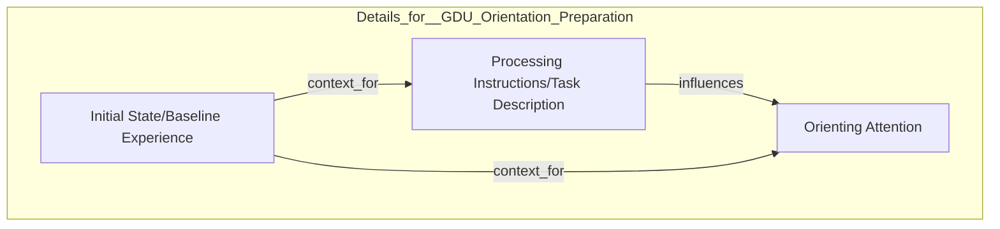
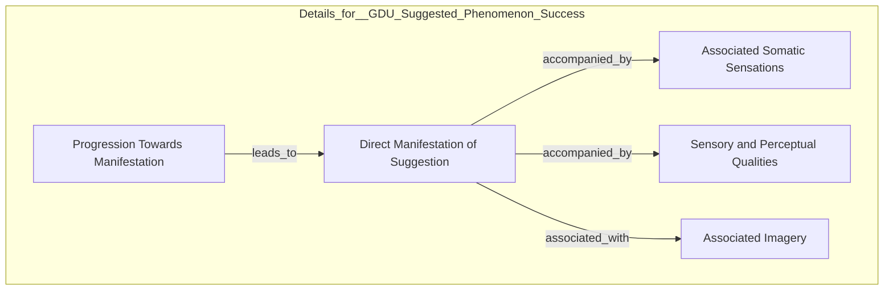
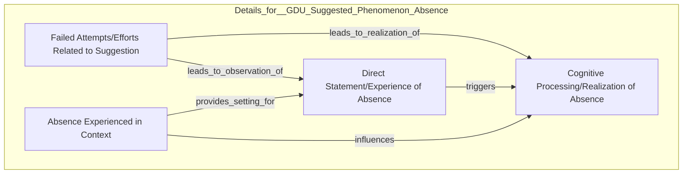
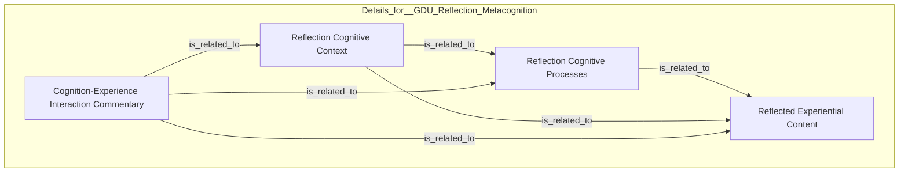

# µ-PATH Analysis Report

**Date:** 2025-06-20
**Analysis Version:** Programmatic v1.1 (Report Refactor)

## 1. Introduction
This report summarizes the findings from the µ-PATH analysis pipeline.
- **Purpose:** To systematically analyze micro-phenomenological interview transcripts to identify common experiential structures and potential causal relationships.
- **Method Overview:** The analysis involved several stages: data preparation, specific diachronic and synchronic analysis per transcript, derivation of generic diachronic and synchronic structures, holistic refinement, and causal modeling.
- **Dependent Variable Focus:** The analysis was guided by the following dependent variable(s): `cognitions`, `emotions`, `sensations`, `imagination`, `internal\_experiences`.
- **Note on Appendices:** This report focuses on synthesized findings. Detailed per-transcript analyses, specific-level diagrams, full quantitative summaries, and GSS grounding traces are available in the accompanying **HTML Appendix**.

## 2. Transcripts Analyzed
| Filename | Independent Variable \(IV\) Details | \# Diachronic Phases \(P1\.4\) | \# Core GDUs Involved |
| --- | --- | --- | --- |
| p3s3\.txt | Participant 3, Suggestion 3 \(Scored 0/5\) | 5 | 1 |
| p4s1\.txt | Participant 4, Suggestion 1 \(Scored 5/5\) | 3 | 2 |
| p4s2\.txt | Participant 4, Suggestion 2 \(Scored 4/5\) | 3 | 2 |
| p4s3\.txt | Participant 4, Suggestion 3 \(Scored 4/5\) | 4 | 2 |
| p5s1\.txt | Participant 5, Suggestion 1 \(Scored 4/5\) | 3 | 2 |
| p5s2\.txt | Suggestion 2 \(Scored 3/5\) | 4 | 2 |
| p5s3\.txt | Participant 5, Suggestion 3 \(Scored 0/5\) | 6 | 3 |
| p6s1\.txt | Participant 6 Suggestion 1 \(Scored 4/5\) | 2 | 2 |
| p6s2\.txt | Participant 6 Suggestion 2 \(Scored 5/5\) | 3 | 2 |
| p6s3\.txt | Participant 6 Suggestion 3 \(Scored 5/5\) | 2 | 2 |
| p7s1\.txt | Participant 7 Suggestion 1 \(Scored 2/5\) | 3 | 2 |
| p7s2\.txt | Participant 7 Suggestion 2 \(Scored 1/5\) | 5 | 3 |
| p7s3\.txt | Participant 7 Suggestion 3 \(Scored 0/5\) | 4 | 3 |
| p1s1\.txt | Suggestion 1 \(Scored 4/5\) | 5 | 2 |
| p1s2\.txt | Participant 1, Suggestion 2 \(Scored 4/5\) | 4 | 3 |
| p1s3\.txt | Participant 1, Suggestion 3 \(Scored 1/5\) | 6 | 2 |
| p2s1\.txt | Participant 2, Suggestion 1 \(Scored 4/5\) | 4 | 3 |
| p2s2\.txt | Participant 2, Suggestion 2 \(Scored 1/5\) | 2 | 0 |
| p2s3\.txt | Participant 2, Suggestion 3 \(Scored 0/5\) | 3 | 2 |
| p3s1\.txt | Participant 3, Suggestion 1 \(Scored 2/5\) | 3 | 2 |
| p3s2\.txt | Participant 3, Suggestion 2 \(Scored 1/5\) | 4 | 2 |

*For detailed Specific Diachronic Structure (SDS) and Specific Synchronic Structure (SSS) diagrams for each transcript and phase, please refer to the HTML Appendix.*

## 3. Generic Diachronic Structure (GDS)
### 3.1. GDS Definition: Suggestion Experience Diachronic Structure
- **Description:** This Generic Diachronic Structure describes the typical progression of a participant's reported experience during a suggestion, from initial orientation through the core event \(or lack thereof\) and subsequent reflection\. The specific content and presence of certain phases are strongly modulated by the success of the suggestion\.
- **Core GDUs:** `GDU\_Orientation\_Preparation`, `GDU\_Suggested\_Phenomenon\_Success`, `GDU\_Suggested\_Phenomenon\_Absence`, `GDU\_Reflection\_Metacognition`
- **Optional GDUs:** `GDU\_Attempt\_Strategy`, `GDU\_Transition\_Shift`, `GDU\_Unrelated\_Cognitive\_Activity`
- **Typical Sequence:** `GDU\_Orientation\_Preparation` -> `GDU\_Attempt\_Strategy` -> `GDU\_Suggested\_Phenomenon\_Success` -> `GDU\_Suggested\_Phenomenon\_Absence` -> `GDU\_Transition\_Shift` -> `GDU\_Reflection\_Metacognition`

### Generic Diachronic Structure: Suggestion Experience Diachronic Structure

```mermaid
gantt
dateFormat X
title GDS: Suggestion Experience Diachronic Structure
axisFormat %s

section Typical Sequence
GDU_Orientation_Preparation :GDU_Orientation_Preparation, 0, 1d
GDU_Attempt_Strategy :GDU_Attempt_Strategy, 1, 1d
GDU_Suggested_Phenomenon_Success :GDU_Suggested_Phenomenon_Success, 2, 1d
GDU_Suggested_Phenomenon_Absence :GDU_Suggested_Phenomenon_Absence, 3, 1d
GDU_Transition_Shift :GDU_Transition_Shift, 4, 1d
GDU_Reflection_Metacognition :GDU_Reflection_Metacognition, 5, 1d

```

### 3.2. GDS Quantitative Summary Notes
Detailed tables for GDU vs. Utterances per transcript and GDU transitions per transcript are available in the HTML Appendix. These tables provide granular counts showing the distribution and flow of GDUs across the analyzed dataset.

## 4. Generic Synchronic Structures (GSS) - Per Core GDU
### 4.1. GSS for GDU: `GDU\_Orientation\_Preparation`
- **GDU Definition:** Units describing the initial state, orienting attention, setting expectations, or physical preparation before the core suggested experience or attempt begins\.
- **GSS Description:** Generic Synchronic Structure for GDU 'GDU\_Orientation\_Preparation', representing the participant's state and activity during the initial phase of receiving instructions and preparing for the core task\.
- **Key Categories/Nodes:** `Processing Instructions/Task Description`, `Orienting Attention`, `Initial State/Baseline Experience`

### GSS for GDU: GDU\\\_Orientation\\\_Preparation

#### Instantiation Summary:
This GSS is instantiated by specific elements from the source transcripts. For a detailed grounding trace of each GSS category (e.g., `Processing Instructions/Task Description`) back to its constituent Specific Synchronic Structure (SSS) nodes and original utterances, please refer to the **'GSS Category Grounding Trace'** section in the HTML Appendix.

### 4.2. GSS for GDU: `GDU\_Suggested\_Phenomenon\_Success`
- **GDU Definition:** Units describing the successful manifestation of the suggested phenomenon \(e\.g\., hands moving/sticking, hearing sound\), its qualities, intensity, progression, or associated sensations/imagery that support the experience\.
- **GSS Description:** Generic Synchronic Structure for the successful manifestation of a suggested phenomenon, derived from grouped SSS nodes representing core outcomes, associated sensations, perceptual qualities, progression, and imagery\.
- **Key Categories/Nodes:** `Direct Manifestation of Suggestion`, `Associated Somatic Sensations`, `Sensory and Perceptual Qualities`, `Progression Towards Manifestation`, `Associated Imagery`

### GSS for GDU: GDU\\\_Suggested\\\_Phenomenon\\\_Success

#### Instantiation Summary:
This GSS is instantiated by specific elements from the source transcripts. For a detailed grounding trace of each GSS category (e.g., `Direct Manifestation of Suggestion`) back to its constituent Specific Synchronic Structure (SSS) nodes and original utterances, please refer to the **'GSS Category Grounding Trace'** section in the HTML Appendix.

### 4.3. GSS for GDU: `GDU\_Suggested\_Phenomenon\_Absence`
- **GDU Definition:** Units describing the lack of the suggested phenomenon, the realization that it is not occurring, or the outcome of attempts that did not result in the suggested experience\.
- **GSS Description:** Generic Synchronic Structure for the GDU 'GDU\_Suggested\_Phenomenon\_Absence', representing the common elements and their relationships when the suggested phenomenon does not occur\.
- **Key Categories/Nodes:** `Direct Statement/Experience of Absence`, `Cognitive Processing/Realization of Absence`, `Failed Attempts/Efforts Related to Suggestion`, `Absence Experienced in Context`

### GSS for GDU: GDU\\\_Suggested\\\_Phenomenon\\\_Absence

#### Instantiation Summary:
This GSS is instantiated by specific elements from the source transcripts. For a detailed grounding trace of each GSS category (e.g., `Direct Statement/Experience of Absence`) back to its constituent Specific Synchronic Structure (SSS) nodes and original utterances, please refer to the **'GSS Category Grounding Trace'** section in the HTML Appendix.

### 4.4. GSS for GDU: `GDU\_Reflection\_Metacognition`
- **GDU Definition:** Units where the participant comments on the experience, the process, their strategies, the nature of the phenomenon \(e\.g\., automaticity, reality, effort\), or draws conclusions about the suggestion's effect\.
- **GSS Description:** Generic Synchronic Structure for GDU 'GDU\_Reflection\_Metacognition', representing the interplay between reflected experiential content, cognitive processes involved in reflection, the cognitive context, and the perceived interaction between cognition and experience during reflection\.
- **Key Categories/Nodes:** `Reflected Experiential Content`, `Reflection Cognitive Processes`, `Reflection Cognitive Context`, `Cognition-Experience Interaction Commentary`

### GSS for GDU: GDU\\\_Reflection\\\_Metacognition

#### Instantiation Summary:
This GSS is instantiated by specific elements from the source transcripts. For a detailed grounding trace of each GSS category (e.g., `Reflected Experiential Content`) back to its constituent Specific Synchronic Structure (SSS) nodes and original utterances, please refer to the **'GSS Category Grounding Trace'** section in the HTML Appendix.

### 4.5. GSS Quantitative Summary Notes
Detailed tables for GSS Category vs. Utterances per transcript are available in the HTML Appendix, providing insight into the prevalence of each generic synchronic component.

## 5. Holistic Refinement Summary (P5.1)
The refined Generic Diachronic Structure for the Suggestion Experience captures the typical flow from initial reception to potential integration or rejection\. Key refinements involved clarifying the transition points between phases and ensuring the core GDUs represent distinct experiential shifts observed across the specific diachronic structures\. The structure now emphasizes the internal processing and reaction phases as central to the experience, often involving a dynamic interplay of cognitions, emotions, and imagination\.

**Refined GSS Summaries:**
- **GDU `GDU\_1\_Receiving\_Suggestion`:** The GSS for 'Receiving Suggestion' focuses on the initial sensory input \(auditory/visual\), immediate cognitive registration, and any initial emotional 'flavor' or bodily sensation accompanying the reception\. Refinements included adding categories for 'initial attention focus' and 'immediate sense of familiarity/novelty'\.
- **GDU `GDU\_2\_Processing\_Suggestion`:** The GSS for 'Processing Suggestion' is the most complex, detailing the internal work of evaluating, understanding, and imagining outcomes\. Refinements involved splitting 'evaluation' into 'source evaluation' and 'content evaluation', adding categories for 'internal dialogue/questioning', 'accessing relevant memories', and 'imagining potential consequences'\. This GSS heavily reflects the DV focus on cognitions and imagination\.
- **GDU `GDU\_3\_Reacting\_to\_Suggestion`:** The GSS for 'Reacting to Suggestion' captures the emergent internal stance towards the suggestion – acceptance, rejection, ambivalence, or uncertainty\. Refinements clarified the distinction between cognitive assessment \(GDU 2\) and the more holistic, often emotionally charged, internal 'leaning' or 'feeling' about the suggestion\. Categories for 'sense of internal alignment/dissonance' and 'emergent motivation/resistance' were added\.
- **GDU `GDU\_4\_Integrating\_or\_Discarding`:** The GSS for 'Integrating or Discarding' describes the state after a decision or stance has been reached\. It includes categories related to planning action \(if accepted\), feeling closure \(if discarded\), or lingering uncertainty\. Refinements focused on capturing the residual emotional and cognitive states and the shift in attention away from the suggestion itself towards future action or other concerns\.

### 5.1. Refinement Log
- **Observation:** Initial GSS for 'Processing' \(GDU\_2\) conflated evaluation of the suggestion's content with evaluation of the source\.
  - **Adjustment:** Split 'Evaluation' category in GSS\_2 into 'Evaluating Source' and 'Evaluating Content'\.
  - **Justification:** Specific SSS nodes consistently showed distinct experiential qualities and focuses depending on whether the participant was assessing the speaker's trustworthiness vs\. the idea's merit\. This split improves granularity and aligns better with cognitive models of persuasion\.

- **Observation:** Many SSS nodes in GDU\_2 described internal questioning or debate, which wasn't explicitly captured\.
  - **Adjustment:** Added 'Internal Dialogue/Questioning' category to GSS\_2\.
  - **Justification:** This represents a significant and frequent mode of processing observed in the data, distinct from simple evaluation or memory access\.

- **Observation:** The transition from GDU\_2 \(Processing\) to GDU\_3 \(Reacting\) was sometimes unclear in SDSs; the 'reaction' felt more like an emergent state than a discrete event\.
  - **Adjustment:** Refined GDU\_3 description to emphasize 'emergence of an internal stance' and added GSS\_3 categories like 'Sense of Internal Alignment/Dissonance' and 'Emergent Motivation/Resistance' to capture this felt sense\.
  - **Justification:** This better reflects the phenomenological data, where the 'decision' or 'reaction' is often experienced as a feeling or inclination solidifying, rather than a purely rational conclusion\.

- **Observation:** IV analysis showed that source credibility strongly influenced the duration and content of GDU\_2 \(Processing\) and the nature of GDU\_3 \(Reacting\)\.
  - **Adjustment:** Ensured GSS\_2 includes 'Evaluating Source' and GSS\_3 includes categories capturing the \*felt sense\* of the reaction, as high credibility often led to quicker processing and a stronger sense of alignment/motivation\.
  - **Justification:** Explicitly incorporating source evaluation and the felt sense of reaction allows the GSSs to better capture the impact of this key IV on the subjective experience\.

- **Observation:** Suggestion complexity \(IV\) correlated with the level of 'Cognitive Effort' and the frequency of 'Internal Dialogue/Questioning' nodes in GDU\_2\.
  - **Adjustment:** Included 'Cognitive Effort' and 'Internal Dialogue/Questioning' as distinct categories in GSS\_2\.
  - **Justification:** These categories are crucial for capturing the experiential load associated with processing complex suggestions, a direct link to an IV\.

### 5.2. Emergent Insights
- Insight\_1: The 'Processing Suggestion' phase \(GDU\_2\) is not purely cognitive; it is deeply intertwined with emergent emotional and somatic states, particularly those related to perceived alignment or dissonance with one's self-concept or values\.
- Insight\_2: The transition to 'Reacting to Suggestion' \(GDU\_3\) is often marked by a shift from analytical thought to a more holistic, felt sense of 'rightness' or 'wrongness' about the suggestion, frequently accompanied by specific bodily sensations\.
- Insight\_3: Imagination plays a critical role in GDU\_2, not just in simulating outcomes but also in accessing and re-experiencing relevant past memories, which directly influences evaluation and subsequent reaction\.
- Insight\_4: The impact of IVs like source credibility and suggestion complexity is experientially traceable, affecting not just \*whether\* a suggestion is accepted, but \*how\* it is processed and \*what\* it feels like to process and react to it \(e\.g\., high credibility reduces cognitive effort and increases positive felt sense in GDU\_3\)\.

### 5.3. Initial Hypotheses (from P5)
- PhenoHyp\_1: The intensity of 'Sense of Internal Alignment/Dissonance' \(GSS\_3\) is positively correlated with the vividness and emotional charge of 'Imagining Potential Consequences' \(GSS\_2\) that align or conflict with the suggestion\.
- PhenoHyp\_2: Experiences categorized as 'Cognitive Effort' \(GSS\_2\) are consistently accompanied by specific somatic sensations \(GSS\_2 'Associated Sensations'\), such as tension in the head, eyes, or shoulders\.
- PhenoHyp\_3: When 'Evaluating Source' \(GSS\_2\) results in a judgment of low credibility, the subsequent 'Emergent Motivation/Resistance' \(GSS\_3\) will predominantly be resistance, regardless of the 'Evaluating Content' outcome\.
- PhenoHyp\_4: The presence and nature of 'Internal Dialogue/Questioning' \(GSS\_2\) mediate the relationship between 'Suggestion Complexity' \(IV\) and the duration of the 'Processing Suggestion' phase \(GDU\_2\)\.
## 6. Proposed Causal Model
### 6.1. Formal Variables (P7.1)
| ID | Name | Phenomenological Grounding \(Excerpt\) | Measurement Type | Grounding Refs \(Type:ID\) |
| --- | --- | --- | --- | --- |
| X\_Suggest | Suggestion Stimulus | Represents the specific content or type of suggest\.\.\. | Categorical \(e\.g\., 'Hands Stuck', 'Happy Birthday'\) | GDU:GDU\_1\_Receiving\_Suggestion, IV:Suggestion Type/Content |
| X\_SourceCred | Source Credibility | Represents the participant's perception of the sou\.\.\. | Ordinal/Continuous \(e\.g\., Rating 1-5, or pre-determined high/low\) | IV:Source Credibility, GSS\_Category:gss\_2\_evaluating\_source, P5\_Insight:Insight\_4, P5\_Hypothesis:PhenoHyp\_3 |
| X\_SuggestComplex | Suggestion Complexity | Represents the objective or perceived difficulty i\.\.\. | Ordinal/Continuous \(e\.g\., Rating 1-5, or pre-determined high/low\) | IV:Suggestion Complexity, GSS\_Category:gss\_2\_understanding\_content, GSS\_Category:gss\_2\_cognitive\_effort, GSS\_Category:gss\_2\_internal\_dialogue, P5\_Insight:Insight\_4, P5\_Hypothesis:PhenoHyp\_4 |
| M\_InitCogReg | Initial Cognitive Registration | Captures the immediate, surface-level cognitive pr\.\.\. | Categorical/Ordinal \(e\.g\., 'Recognized Topic', 'Confused'\) or Latent/Score | GSS\_Category:gss\_1\_initial\_cognitive\_registration |
| M\_InitEmotion | Initial Emotional Flavor | Represents any immediate, subtle emotional tone or\.\.\. | Categorical/Ordinal \(e\.g\., 'Curiosity', 'Apprehension'\) or Latent/Score | GSS\_Category:gss\_1\_initial\_emotional\_flavor |
| M\_InitBodilySens | Initial Bodily Sensation | Represents any immediate physical sensation accomp\.\.\. | Categorical/Ordinal \(e\.g\., 'Tension', 'Relaxation'\) or Latent/Score | GSS\_Category:gss\_1\_initial\_bodily\_sensation |
| M\_Understand | Understanding Content | Represents the effort and outcome of grasping the \.\.\. | Ordinal/Continuous \(e\.g\., Depth of understanding score\) or Latent | GSS\_Category:gss\_2\_understanding\_content |
| M\_EvalSource | Evaluating Source | Represents the assessment of the source's credibil\.\.\. | Ordinal/Continuous \(e\.g\., Credibility score\) or Latent | GSS\_Category:gss\_2\_evaluating\_source, P5\_Insight:Insight\_4, P5\_Hypothesis:PhenoHyp\_3 |
| M\_EvalContent | Evaluating Content | Represents the assessment of the suggestion's feas\.\.\. | Ordinal/Continuous \(e\.g\., Feasibility/Desirability score\) or Latent | GSS\_Category:gss\_2\_evaluating\_content |
| M\_Imagine | Imagining Consequences | Represents the mental simulation of outcomes relat\.\.\. | Ordinal/Continuous \(e\.g\., Vividness/Emotionality score\) or Latent | GSS\_Category:gss\_2\_imagining\_consequences, P5\_Insight:Insight\_3, P5\_Hypothesis:PhenoHyp\_1 |
| M\_InternalDialog | Internal Dialogue/Questioning | Represents the inner speech or questioning related\.\.\. | Binary \(Yes/No\) or Continuous \(e\.g\., Frequency/Intensity score\) or Latent | GSS\_Category:gss\_2\_internal\_dialogue, P5\_Hypothesis:PhenoHyp\_4, P5\_Insight:Insight\_4 |
| M\_CogEffort | Cognitive Effort | Represents the subjective sense of mental work or \.\.\. | Ordinal/Continuous \(e\.g\., Effort rating\) or Latent | GSS\_Category:gss\_2\_cognitive\_effort, P5\_Hypothesis:PhenoHyp\_2, P5\_Insight:Insight\_4 |
| M\_AssocSensG2 | Associated Sensations \(GDU2\) | Represents bodily sensations linked to the process\.\.\. | Categorical/Ordinal \(e\.g\., Type/Intensity\) or Latent | GSS\_Category:gss\_2\_associated\_sensations, P5\_Hypothesis:PhenoHyp\_2 |
| M\_DurationG2 | Duration GDU2 | Represents the length of time spent in the Process\.\.\. | Continuous \(Time in seconds/minutes\) | GDU:GDU\_2\_Processing\_Suggestion, P5\_Hypothesis:PhenoHyp\_4 |
| M\_AlignmentDiss | Sense of Internal Alignment/Dissonance | Represents the felt sense of whether the suggestio\.\.\. | Ordinal/Continuous \(e\.g\., Alignment score -5 to \+5\) or Latent | GSS\_Category:gss\_3\_sense\_of\_internal\_alignment\_dissonance, P5\_Insight:Insight\_1, P5\_Insight:Insight\_2, P5\_Insight:Insight\_4, P5\_Hypothesis:PhenoHyp\_1 |
| M\_MotivationRes | Emergent Motivation/Resistance | Represents the felt pull towards or push against a\.\.\. | Ordinal/Continuous \(e\.g\., Motivation score -5 to \+5\) or Latent | GSS\_Category:gss\_3\_emergent\_motivation\_resistance, P5\_Insight:Insight\_2, P5\_Hypothesis:PhenoHyp\_3 |
| M\_AssocBodilyG3 | Associated Bodily State \(GDU3\) | Represents the overall physical feeling accompanyi\.\.\. | Categorical/Ordinal \(e\.g\., Type/Intensity\) or Latent | GSS\_Category:gss\_3\_associated\_bodily\_state, P5\_Insight:Insight\_2 |
| Y\_FinalStance | Final Stance/Decision | Represents the outcome of the suggestion experienc\.\.\. | Categorical \(e\.g\., 'Accepted', 'Rejected', 'Ambivalent'\) or Ordinal \(e\.g\., Likelihood of acceptance 0-10\) | GDU:GDU\_3\_Reacting\_to\_Suggestion, GDU:GDU\_4\_Integrating\_or\_Discarding, DV\_Focus:Internal Processing and Reaction |

### 6.2. Causal Graph (P7.3b / P7.3)

### Cleaned Causal DAG

```mermaid
graph TD;
    X_Suggest["Suggestion Stimulus"];
    X_SourceCred["Source Credibility"];
    X_SuggestComplex["Suggestion Complexity"];
    M_InitCogReg["Initial Cognitive Registration"];
    M_InitEmotion["Initial Emotional Flavor"];
    M_InitBodilySens["Initial Bodily Sensation"];
    M_Understand["Understanding Content"];
    M_EvalSource["Evaluating Source"];
    M_EvalContent["Evaluating Content"];
    M_Imagine["Imagining Consequences"];
    M_InternalDialog["Internal Dialogue/Questioning"];
    M_CogEffort["Cognitive Effort"];
    M_AssocSensG2["Associated Sensations (GDU2)"];
    M_DurationG2["Duration GDU2"];
    M_AlignmentDiss["Sense of Internal Alignment/Dissonance"];
    M_MotivationRes["Emergent Motivation/Resistance"];
    M_AssocBodilyG3["Associated Bodily State (GDU3)"];
    Y_FinalStance["Final Stance/Decision"];
    X_Suggest -->|"The Suggestion Stimulus (X_Suggest) i..."| M_InitCogReg;
    X_Suggest -->|"The nature of the Suggestion Stimulus..."| M_InitEmotion;
    X_Suggest -->|"The Suggestion Stimulus (X_Suggest) c..."| M_InitBodilySens;
    X_Suggest -->|"The specific content and phrasing of ..."| M_Understand;
    X_Suggest -->|"The content of the Suggestion Stimulu..."| M_EvalContent;
    X_Suggest -->|"The Suggestion Stimulus (X_Suggest) p..."| M_Imagine;
    X_Suggest -->|"The specific content or nature of the..."| M_InternalDialog;
    X_Suggest -->|"The novelty or complexity of the Sugg..."| M_CogEffort;
    X_SourceCred -->|"The participants perception of Sour..."| M_EvalSource;
    X_SourceCred -->|"The GSS_2 network shows a link from ..."| M_EvalContent;
    X_SourceCred -->|"P5_Insight_4 states that high source ..."| M_CogEffort;
    X_SourceCred -->|"P5_Insight_4 suggests that high sourc..."| M_AlignmentDiss;
    X_SourceCred -->|"P5_Hypothesis_3 explicitly links Eva..."| M_MotivationRes;
    X_SuggestComplex -->|"The objective or perceived Suggestio..."| M_Understand;
    X_SuggestComplex -->|"P5_Hypothesis_4 links Suggestion Com..."| M_InternalDialog;
    X_SuggestComplex -->|"P5_Insight_4 and the GSS_2 structure ..."| M_CogEffort;
    X_SuggestComplex -->|"P5_Hypothesis_4 explicitly links Sug..."| M_DurationG2;
    M_InitCogReg -->|"The GDS shows GDU_1 precedes GDU_2. T..."| M_Understand;
    M_InitEmotion -->|"The GDS shows GDU_1 precedes GDU_3. T..."| M_AlignmentDiss;
    M_InitBodilySens -->|"The GDS shows GDU_1 precedes GDU_3. T..."| M_AssocBodilyG3;
    M_Understand -->|"The GSS_2 network explicitly links u..."| M_EvalContent;
    M_Understand -->|"A clear Understanding Content (M_Un..."| M_Imagine;
    M_Understand -->|"Difficulties in Understanding Conten..."| M_InternalDialog;
    M_Understand -->|"The GSS_2 network explicitly links u..."| M_CogEffort;
    M_Understand -->|"The GDS shows GDU_2 precedes GDU_3. A..."| M_AlignmentDiss;
    M_EvalSource -->|"The GSS_2 network explicitly links e..."| M_EvalContent;
    M_EvalSource -->|"The outcome of Evaluating Source (M..."| M_Imagine;
    M_EvalSource -->|"The GDS shows GDU_2 precedes GDU_3. T..."| M_AlignmentDiss;
    M_EvalContent -->|"The GSS_2 network explicitly links e..."| M_Imagine;
    M_EvalContent -->|"The GDS shows GDU_2 precedes GDU_3. T..."| M_AlignmentDiss;
    M_Imagine -->|"P5_Hypothesis_1 explicitly states tha..."| M_AlignmentDiss;
    M_Imagine -->|"The GDS shows GDU_2 precedes GDU_3. T..."| M_MotivationRes;
    M_InternalDialog -->|"Engaging in Internal Dialogue/Questi..."| M_CogEffort;
    M_InternalDialog -->|"P5_Hypothesis_4 suggests Internal Di..."| M_DurationG2;
    M_InternalDialog -->|"The GDS shows GDU_2 precedes GDU_3. ..."| M_AlignmentDiss;
    M_CogEffort -->|"P5_Hypothesis_2 explicitly states tha..."| M_AssocSensG2;
    M_CogEffort -->|"The GDS shows GDU_2 precedes GDU_3. T..."| M_AlignmentDiss;
    M_AssocSensG2 -->|"The GDS shows GDU_2 precedes GDU_3. ..."| M_AssocBodilyG3;
    M_AssocSensG2 -->|"The GDS shows GDU_2 precedes GDU_3. S..."| M_AlignmentDiss;
    M_DurationG2 -->|"The GDS shows GDU_2 precedes GDU_3. T..."| M_AlignmentDiss;
    M_AlignmentDiss -->|"The GSS_3 network explicitly links s..."| M_MotivationRes;
    M_AlignmentDiss -->|"P5_Insight_2 highlights the shift to ..."| M_AssocBodilyG3;
    M_AlignmentDiss -->|"The Sense of Internal Alignment/Diss..."| Y_FinalStance;
    M_MotivationRes -->|"Motivation or resistance (M_Motivatio..."| M_AssocBodilyG3;
    M_MotivationRes -->|"The Emergent Motivation/Resistance ..."| Y_FinalStance;
    M_AssocBodilyG3 -->|"The Associated Bodily State (GDU3) ..."| Y_FinalStance;

```

#### DAG Cleaning Resolution Log (P7.3b):
- **Action:** 
  - **Reason:** 
  - **Details:** 

### 6.3. Formal Causal Hypotheses (P7.5)
#### Hypothesis: `Causal\_H1`
- **Claim:** Source Credibility \(X\_SourceCred\) causally influences Final Stance/Decision \(Y\_FinalStance\), mediated sequentially by Evaluating Source \(M\_EvalSource\) and Sense of Internal Alignment/Dissonance \(M\_AlignmentDiss\)\.
- **Concept:** Sequential Mediation
- **Formal Query:** `E\[Y\_FinalStance \| do\(X\_SourceCred=high\)\] \!= E\[Y\_FinalStance \| do\(X\_SourceCred=low\)\] via path X\_SourceCred -> M\_EvalSource -> M\_AlignmentDiss -> Y\_FinalStance`
- **Testable Prediction:** Increasing the perceived Source Credibility is predicted to lead to a more favorable Final Stance, and this effect is expected to be significantly attenuated or eliminated if M\_EvalSource and M\_AlignmentDiss are controlled for or fixed\.

#### Hypothesis: `Causal\_H2`
- **Claim:** Suggestion Complexity \(X\_SuggestComplex\) directly causes increased Cognitive Effort \(M\_CogEffort\)\.
- **Concept:** Direct Causal Effect
- **Formal Query:** `E\[M\_CogEffort \| do\(X\_SuggestComplex=high\)\] > E\[M\_CogEffort \| do\(X\_SuggestComplex=low\)\]`
- **Testable Prediction:** Suggestions rated as higher in complexity are predicted to result in higher reported levels of Cognitive Effort during processing\.

#### Hypothesis: `Causal\_H3`
- **Claim:** Understanding Content \(M\_Understand\) causally influences Sense of Internal Alignment/Dissonance \(M\_AlignmentDiss\), mediated by Imagining Consequences \(M\_Imagine\)\.
- **Concept:** Mediation
- **Formal Query:** `E\[M\_AlignmentDiss \| do\(M\_Understand=high\)\] \!= E\[M\_AlignmentDiss \| do\(M\_Understand=low\)\] via path M\_Understand -> M\_Imagine -> M\_AlignmentDiss`
- **Testable Prediction:** Improving the clarity and ease of Understanding Content is predicted to influence the Sense of Internal Alignment/Dissonance, and this effect is expected to be mediated by the nature and vividness of Imagined Consequences\.

#### Hypothesis: `Causal\_H4`
- **Claim:** Sense of Internal Alignment/Dissonance \(M\_AlignmentDiss\) directly influences the nature or intensity of Associated Bodily State \(GDU3\) \(M\_AssocBodilyG3\)\.
- **Concept:** Direct Causal Effect
- **Formal Query:** `E\[M\_AssocBodilyG3 \| do\(M\_AlignmentDiss=dissonance\)\] \!= E\[M\_AssocBodilyG3 \| do\(M\_AlignmentDiss=alignment\)\]`
- **Testable Prediction:** Experiencing greater internal dissonance is predicted to be directly associated with specific, potentially distinct, bodily sensations in the final reaction phase \(GDU3\), compared to experiencing alignment\.

## 7. Conclusion
This report presents a summary of the automated micro-phenomenological analysis. Further interpretation and validation by human researchers are recommended. For detailed specific-level analyses, diagrams, and quantitative data, please consult the accompanying HTML Appendix.

## 8. Appendix: Mermaid Diagram Syntaxes (Generic Structures & Causal DAG)
This section provides the raw Mermaid.js syntax for the high-level generic diagrams and the causal DAG included in this report for reference and reproducibility.

### Syntax for: GDS: Suggestion Experience Diachronic Structure

### Syntax for: Cleaned Causal DAG

### Syntax for: GSS for GDU: GDU\_Orientation\_Preparation

### Syntax for: GSS for GDU: GDU\_Suggested\_Phenomenon\_Success

### Syntax for: GSS for GDU: GDU\_Suggested\_Phenomenon\_Absence

### Syntax for: GSS for GDU: GDU\_Reflection\_Metacognition

